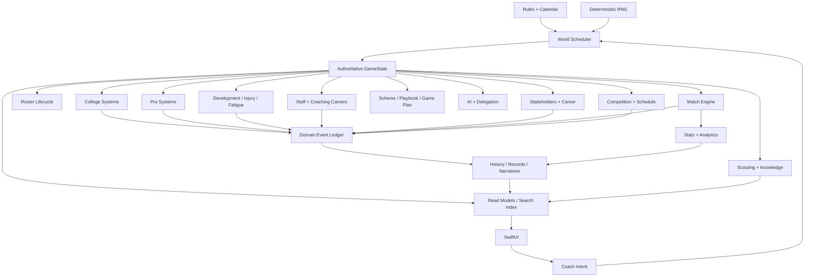

# Pro Football Coach — Master Build Blueprint
## Backend-first plan for the “Football Manager of American Football”

### 1. Product objective

Build a deterministic, offline, single-player coaching-career simulation in which the player can spend decades inside one fictional football world. The long-term hook is not direct player control. It is the repeated loop:

**Observe → diagnose → decide → delegate → watch consequences → remember → adapt.**

The game must make five timescales simultaneously meaningful:

1. **Snap:** a tactical exception or call-in.
2. **Game:** whether a specific football hypothesis worked.
3. **Week:** preparation, practice, recruiting/front-office, people management.
4. **Season:** roster construction, staff, competition, expectations.
5. **Career:** jobs, rivals, coaching tree, records, institutional history.

The backend must therefore model not only results, but **causes, relationships, knowledge, history and consequences**.

---

## 2. Architecture decision

### Preserve from current architecture
- `FootballSimCore` remains pure Swift with no UI imports.
- Determinism remains non-negotiable.
- Rules remain centralized per tier.
- IDs are stable and RNG is hierarchical.
- UI submits intents; simulation produces state.
- Match rendering never determines match outcomes.
- College and pro share one save and one coach.
- Abstract simulation is required for non-player-controlled teams.

### Add before expanding the game
The current code has a deterministic match/world foundation, but it lacks the structures needed to support a deep, interconnected management game.

Add these three backbones:

#### A. `GameState`
One root aggregate containing the authoritative world state:
- calendar
- competitions
- teams/programmes
- players
- staff
- recruiting/prospect state
- contracts/cap
- injuries/development
- career
- stakeholders
- schedule/results
- knowledge/scouting
- history indexes
- system queues

Systems mutate only through deterministic transitions from one `GameState` to the next.

#### B. `WorldScheduler`
A single ordered pipeline for every simulation boundary.

Example weekly order:
1. resolve expiring inbound events
2. process injuries/recovery
3. run practice/development
4. update scouting knowledge
5. process recruiting/free-agency interactions
6. run AI team decisions
7. simulate non-user games
8. resolve user game
9. update standings/rankings
10. update stats/records
11. update relationships/stakeholders
12. generate news/narrative events
13. update job market/staff market
14. run save-growth and integrity checks
15. produce `WeekSnapshot`

This order is explicit, tested and versioned. No feature is allowed to “run whenever convenient.”

#### C. `DomainEventLedger`
Every meaningful world change emits an event.

Examples:
- `PlayerCommitted`
- `RecruitLostToRival`
- `PlayerTransferred`
- `CoachHired`
- `CoachPoached`
- `CoachPromoted`
- `GameWon`
- `UpsetOccurred`
- `RivalryStrengthened`
- `PlayerBrokeRecord`
- `JobOfferReceived`
- `CoachFired`
- `PlayerDrafted`
- `ChampionshipWon`

The event ledger is the source for:
- career timeline
- player histories
- coaching tree
- rivalry stories
- inbox
- media/news
- records
- “remember when” surfaces
- future narrative generation

Do **not** recompute historical meaning from present state.

---

## 3. Core system map

---

## 4. Simulation fidelity model

A Football Manager-scale world cannot simulate every entity at equal fidelity.

Use **three simulation levels**.

### Level 1 — User team / current opponent
Full detail:
- individual players
- practice effects
- injuries/fatigue
- exact game plan
- detailed play-by-play
- personnel tendencies
- scouting knowledge
- relationships

### Level 2 — Relevant world
Used for:
- conference/division rivals
- recruits being pursued
- teams in playoff race
- job-market teams
- former assistants
- high-profile prospects

Simulate at game/drive/decision level, with enough detail to produce believable stats and events.

### Level 3 — Background world
All remaining entities:
- abstract player development
- abstract recruiting
- abstract roster management
- summarized games
- bounded statistics

Promotion between levels is deterministic and must not alter already-resolved outcomes.

---

## 5. Data ownership rules

1. **Authoritative state is normalized.**
   A player exists once. Rosters store IDs.
2. **History is append-only within retention bounds.**
3. **Read models are disposable.**
   They may be rebuilt from state/history.
4. **Knowledge is observer-specific.**
   A recruit’s true rating is not the rating the player sees.
5. **AI sees only information it is entitled to see.**
6. **UI never calculates simulation truth.**
7. **Every mutable collection has a bound or archival policy.**
8. **Money is integer currency.**
9. **All random draws are reachable from an explicit deterministic seed scope.**
10. **Every system declares when it runs and what events it can emit.**

---

## 6. Definition of “complete game”

A complete build requires all of the following to coexist in one save:

- generated fictional world
- schedule, standings, rankings and postseason
- detailed user-team roster
- player generation and lifecycle
- staff generation and career lifecycle
- scheme and playbook identity
- scouting and uncertainty
- college recruiting
- portal
- NIL/resource allocation
- eligibility and scholarships
- pro contracts/cap
- free agency
- draft
- trades
- development
- injuries/fatigue
- opponent scouting
- game-plan preparation
- deterministic match engine
- coordinator AI
- roster AI
- opponent adaptation
- player/staff relationships
- stakeholders and job security
- inbox/event system
- career/job market
- college → pro promotion
- records and historical statistics
- coaching tree
- rivalry evolution
- career/player/team timelines
- search/query system
- save/migration/recovery
- accessibility-safe UI
- 2D top-view match visualization using circles/position IDs
- full season and multi-decade soak tests

If any one is intentionally deferred, it must appear in the Future Simulation Contract rather than silently disappear.
