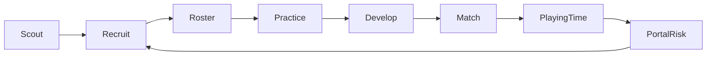
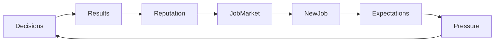

# System Dependency Map

## 1. Dependency principle

Features are not independent. The build must follow dependency direction, not UI priority.

### Dependency layers

**L0 Foundation**
- IDs
- deterministic RNG
- rules
- time/calendar
- coding/persistence primitives

**L1 World**
- players
- staff
- programmes/teams
- conferences/divisions
- locations
- schemes
- competition definitions

**L2 Lifecycle**
- schedule
- roster legality
- contracts/eligibility
- injuries
- development
- staff employment
- player movement

**L3 Decision systems**
- recruiting
- portal
- NIL
- draft
- free agency
- trades
- practice
- game plan
- scouting

**L4 Match**
- lineups/personnel
- play calling
- assignment/leverage
- drive/game
- stats
- injuries/fatigue feedback

**L5 World intelligence**
- AI coaches
- roster AI
- recruiting AI
- front-office AI
- scouting knowledge
- delegation

**L6 Stakes/history**
- stakeholders
- reputation
- job market
- rivalries
- records
- awards
- event ledger
- narratives

**L7 Presentation**
- read models
- search
- UI
- match visualization

A system may depend downward only.

---

## 2. Interconnection matrix

| System | Reads | Writes / Emits | Critical downstream consumers |
|---|---|---|---|
| Player lifecycle | age, position, traits, usage | ratings, status, retirement/eligibility | roster, recruiting, draft, match, history |
| Development | practice, coach quality, age, snaps | attribute deltas, role trajectory | depth chart, player profile, squad planning |
| Injury/fatigue | snaps, workload, durability | availability, performance modifiers | practice, lineup, match, scouting |
| College recruiting | knowledge, programme factors, contact | interest, commitments | future roster, rivalries, career reputation |
| Portal | playing time, relationships, NIL, team success | departures/arrivals | roster, recruiting, history |
| NIL | budget, importance, relationships | retention/recruiting modifiers | portal, recruiting, stakeholders |
| Contracts/cap | contract terms, cap rules | cap charges, dead money, expiry | FA, roster, trades |
| Draft | scouting, needs, board, AI | player rights/contracts | pro roster, history |
| Free agency | market, cap, role | signings, price changes | roster, cap, history |
| Staff careers | performance, reputation, vacancies | hires, departures, promotions | scheme, development, recruiting, coaching tree |
| Scheme | staff identity, roster | fit, tactical constraints | game plan, recruiting, roster valuation |
| Scouting | film/stats/scouts | knowledge/confidence | game plan, recruiting, draft |
| Game plan | opponent knowledge, scheme | tactical instructions | coordinator AI, match |
| Match engine | personnel, tactics, situation | play/game outcomes | stats, injury/fatigue, stakes, history |
| Stats/analytics | play/game outcomes | aggregates, trends | scouting, awards, records, UI |
| Stakeholders | expectations, results, decisions | dispositions, pressure events | career, inbox, job security |
| Career | reputation, performance, vacancies | jobs, offers, firing | world relevance, coaching tree |
| Rivalries | geography, history, game events | rivalry score/events | stakes, schedule flavor, career history |
| History | domain events, stats | timelines/records | player/team/career UI |
| Search/read models | all authoritative state | indexed projections | every UI surface |

---

## 3. Two key feedback loops

### Roster loop

### Career loop

---

## 4. No isolated feature rule

A feature is not complete if its outputs do not feed at least one other system.

Examples:
- Recruiting is incomplete if a recruit has no subsequent development history.
- Staff is incomplete if coordinator quality does not affect play calling/development/recruiting.
- Scouting is incomplete if game-plan choices cannot consume its findings.
- Rivalries are incomplete if rivalry history does not alter pressure or presentation.
- Career is incomplete if former assistants and prior teams disappear from relevance.
